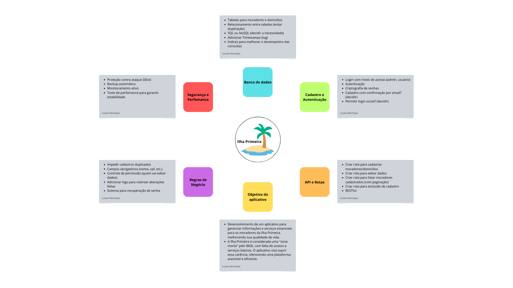

 
## Introdução
 

Mapa mental consiste em criar resumos cheios de símbolos, cores, setas e frases de efeito com o objetivo de organizar o conteúdo e facilitar associações entre as informações destacadas. Esse material é muito indicado para pessoas que têm facilidade de aprender de forma visual.

 
## Metodologia
 

Foi levantado um ponto importante sobre o app e, assim, foi produzido o mapa mental. O documento foi produzido utilizando a ferramenta Canvas.

## Mapa mental
 

 
## Conclusão
 

O mapa mental é uma ficha de estudos que ajuda a dar uma visão geral do tema, e ajuda a fixar os pontos mais importantes sobre o app.

 
## Referências
> Mapa Mental,  Disponível em: [Link](https://www.canva.com/design/DAGi-e0L_2M/K5TL28EoK73wPOhle8FAZg/edit?utm_content=DAGi-e0L_2M&utm_campaign=designshare&utm_medium=link2&utm_source=sharebutton)

 
## Versionamento
| Data | Versão | Descrição | Autor(es) |
| -- | -- | -- | -- |
| 27/03/2025 | 1.0 | Criação do Mapa Mental | Lucas Kronemberger |
