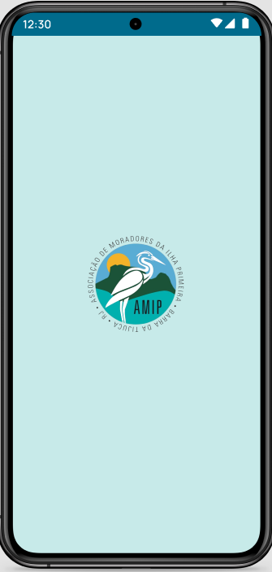
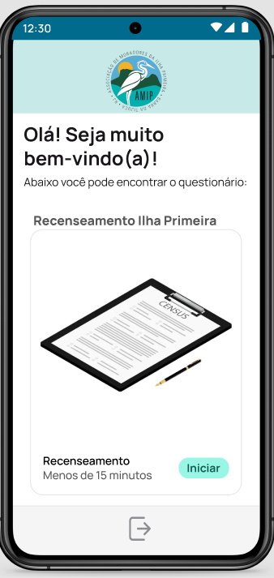
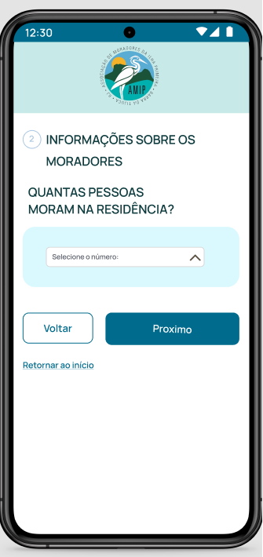

# Não precisa entregar para a AP1
## Introdução
 

A construção do protótipo de alta fidelidade auxilia a equipe de desenvolvimento a encontrar um nível de detalhes abrangentes, extrair funcionalidades, testar usabilidade, e também fornece uma base para o gerenciamento do projeto pois com o protótipo é possível realizar estimativas de quanto tempo será necessário desempenhar em cada funcionalidade.

 
## Metodologia
 

Iniciamos o projeto através dos levantamentos iniciais da equipe, após discussões a ferramenta Figma foi selecionada para produzir o protótipo de alta fidelidade com auxílio do Material Design Color Tool.

 
## Protótipo de alta fidelidade
 
### Versão 1.0
 
### Tela de Carregamento

### Login
 

 
### Tela Inicial
 

 
### Perguntas 1
 

 
### Pergunta 2

 
### Pergunta 3

 
### Tela Perfil

 
### Tela Cadastrar torneio 1

 
### Tela Cadastrar torneio 2
 

 
### Tela Cadastrar torneio 3

 
### Tela Cadastrar torneio 4

 
### Tela com meus torneios

 
### Tela de inscrição em torneio

Protótipo feito pela tuma de Front-end. Link para o <a href="https://www.figma.com/design/cX8mG3fK90aDRvKdE1PcjB/AMIP?node-id=0-1&p=f">Protótipo.</a>

 
### Versão 2.0

### Tela Login

### Tela Cadastro 
 

### Tela Esqueceu Senha
 

### Tela Perfil

### Tela do Feed

### Tela Cadastrar em um torneio

### Tela Cadastrar torneio

### Tela Cadastrar torneio 2

### Tela dos meus torneios

### Tela das chaves do torneio

### Tela das estatíscicas

### Tela de adicionar resultado das partidas

link para o <a href="https://www.figma.com/design/cX8mG3fK90aDRvKdE1PcjB/AMIP?node-id=0-1&p=f">Protótipo</a>
 
## Conclusão
 

A partir da elaboração do protótipo foi possível ter uma noção inicial da interface do usuário, definindo fluxo, paleta de cores, botões, app bars e diversas outras funcionalidades

 
## Referências
 
> Material Design Color Tool. Disponível em:  https://material.io/resources/color/#!/?view.left=0&view.right=0
 
> PMI. Um guia do conhecimento em gerenciamento de projetos. Guia PMBOK® 5a. ed. EUA: Project Management Institute, 2013.
 
> Ferramenta Figma. Disponível em https://www.figma.com
 
## Autor(es)
 
| Data | Versão | Descrição | Autor(es) |
| -- | -- | -- | -- |
| 21/02/25 | 1.0 | Criação do documento | Fabricio de Brito |
| 11/06/25 | 1.1 | Adicionado imagens do protótipo | Lucas Kronemberger, Yago Duarte  |
| 11/06/25 | 1.2 | Adicionado conclusão e referências | Lucas Kronemberger, Yago Duarte |
| 00/00/00 | 2.0 | - - - - - - X - - - - - - | - - - - - - X - - - - - - |
